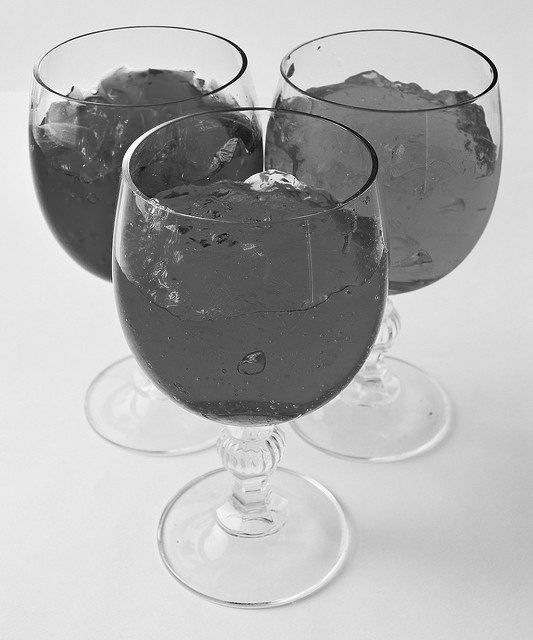
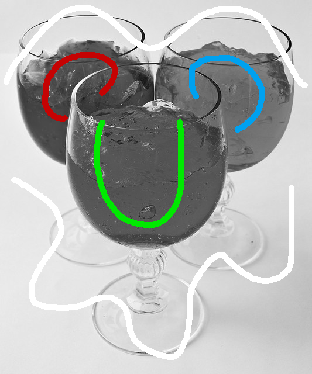
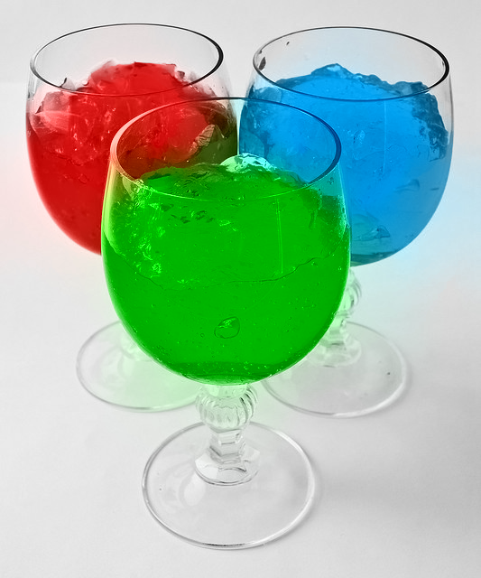
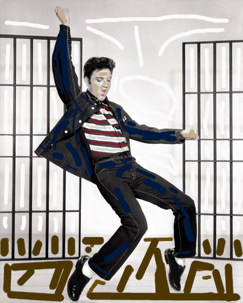

# Colorization using Optimization

Python and C++ implementations of a user-guided image/video colorization technique as proposed by the paper 
[Colorization Using Optimization](https://dl.acm.org/doi/10.1145/1015706.1015780).

## Results

<table style="width:100%">
    <tr>
        <th>Original Image</th>
        <th>Visual Clues</th>
        <th>Colorized Image</th>
    </tr>
    <tr>
        <td></td>
        <td></td>
        <td></td>
    </tr>
    <tr>
        <td></td>
        <td></td>
        <td></td>
    </tr>
    <tr>
        <td></td>
        <td></td>
        <td></td>
    </tr>
    <tr>
        <td></td>
        <td></td>
        <td></td>
    </tr>
    <tr>
        <td></td>
        <td></td>
        <td></td>
    </tr>
    <tr>
        <td></td>
        <td></td>
        <td></td>
    </tr>
    <tr>
        <td></td>
        <td></td>
        <td></td>
    </tr>
    <tr>
        <td></td>
        <td></td>
        <td></td>
    </tr>
</table>
