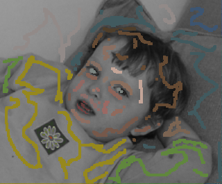
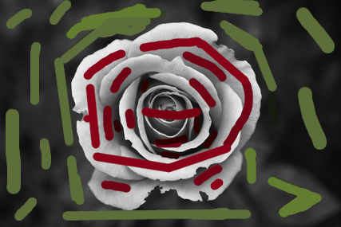
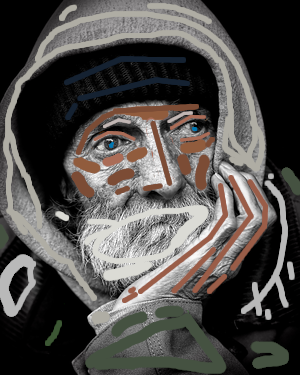

# Colorization using Optimization


Python and C++ implementations of a user-guided image/video colorization technique as proposed by the paper 
[Colorization Using Optimization](https://dl.acm.org/doi/10.1145/1015706.1015780). The algorithm is based on a simple premise; neighboring pixels in space-time that have similar intensities should have similar colors. This premise is formalized using a quadratic cost function that obtains an optimization problem that can be solved efficiently using standard techniques. While using this alogorithm, an artist only needs to annotate the image with a few color scribbles or visual clues, and the indicated colors are automatically propagated in both space and time to produce a fully colorized image or sequence. The annotation can be done using any drawing tool such as [JSPaint](https://jspaint.app/) or [Gimp](https://www.gimp.org/).

## Instructions

### Instructions for running python version

1. Create a virtualenv using:
    - `virtualenv venv --python=python3`
    - `source venv/bin/activate`
    - `pip install -r requirements.txt`

2. Colorize images using the CLI:
    ```
    python colorize.py
    
    Options:
        --original_image TEXT    Original Image Path
        --visual_clue TEXT       Visual Clue Image Path
        --result_path TEXT       Colorized Image Path (without file extensions)
        -i, --use_itercative     Use Iterative Mode
        --epochs INTEGER         Number of epochs for Iterative Mode
        --log_intervals INTEGER  Log Interval
        --help                   Show this message and exit.
    ```

3. Alternatively, you can run on Google Colab using <a href="https://colab.research.google.com/github/soumik12345/colorization-using-optimization/blob/master/Demo.ipynb" target="_parent"></a>

### Instructions to build C++ version

1. Install dependencies using `sh install.sh`

2. Create a build directory `mkdir build && cd build`

3. Generate makefiles and compile using `cmake .. && make`

4. Run the executable using `./colorization [input-image] [visual-clues] [result] [gamma] [threshold]`

5. Alternatively, you can download the executable from [here](https://github.com/soumik12345/colorization-using-optimization/releases/download/0.1/colorization) and run it (installation of dependencies is still needed).

## Results

<table style="width:100%">
    <tr>
        <th>Original Image</th>
        <th>Visual Clues</th>
        <th>Colorized Image</th>
    </tr>
    <tr>
        <td></td>
        <td></td>
        <td></td>
    </tr>
    <tr>
        <td></td>
        <td></td>
        <td></td>
    </tr>
    <tr>
        <td></td>
        <td></td>
        <td></td>
    </tr>
    <tr>
        <td></td>
        <td></td>
        <td></td>
    </tr>
    <tr>
        <td></td>
        <td></td>
        <td></td>
    </tr>
    <tr>
        <td></td>
        <td></td>
        <td></td>
    </tr>
    <tr>
        <td></td>
        <td></td>
        <td></td>
    </tr>
    <tr>
        <td></td>
        <td></td>
        <td></td>
    </tr>
</table>
